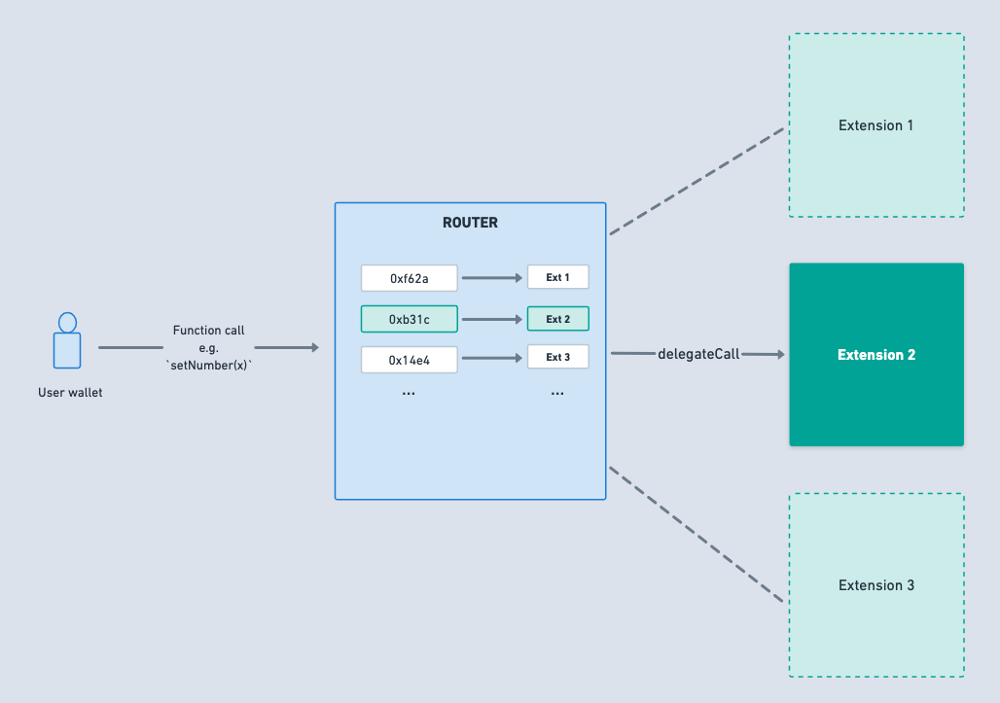
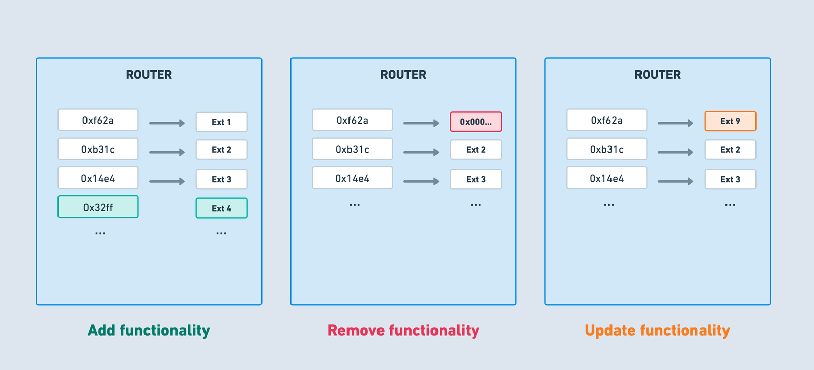

# Diamond Proxy Pattern Implementation 💎
A modular smart contract system that can be upgraded/extended after deployment, and have virtually no size limit. More technically, a diamond is a contract with external functions that are supplied by contracts called facets/implementation contracts. **Facets** are separate, independent contracts that can share internal functions, libraries, and state variables.

## Benefits
1. A single address for unlimited contract functionality.
2. Your contract can exceed the 24KB maximum contract size.
3. Better organize contract code and data.
4. Allows for upgrading functionality or fixing vulnerabilities.

## Architecture
### DiamondProxy
The core proxy contract which is responsible for `delegateCall`ing the target function depending on the `functionSelector` i.e. the first 4 bytes of the transaction calldata.




### DiamondStorage
`DiamondStorage` is a struct storing the **function registry** and other common states of the proxy system which will be shared by the facet and proxy contracts. `DiamondStorage` struct is stored in an arbitrary storage location in `DiamondProxy` contract storage to **avoid storage collisions** with other state variables of the system. This is know as the Diamond Storage pattern.

```solidity
struct DiamondStorage {
    mapping(bytes4 => address) functionSelectorAndFacet;
    address contractOwner;
    mapping(address => uint256) userBalances;
}
```

> We're assuming `contractOwner` to be a single entity for this implementation but can be replaced by more sophisticated entities like DAO to avoid centralisation.

### Function Registry
It is nothing but a simple mapping between `function selectors => facet address`. Facet address is the address to the contract that provides the implementation logic of that particular function.



### Facet Cut
You can consider them as info objects for actions like **adding, replacing and removing** function selectors from the **function registry**, being performed by the administrative authority of the proxy system (which in our case is a single owner address).

```
 /// @dev Defines the action to be performed for a particular FacetCut
 // 0: ADD, 1: REPLACE, 2: REMOVE
 
 enum FacetCutAction {
        ADD,
        REPLACE,
        REMOVE
    }

/// @dev Struct defining a facet action and its corresponding info
    
    struct FacetCut {
        address facetAddress;
        bytes4[] functionSelectors;
        FacetCutAction action;
    }
```

## Major Design Decisions🧑🏻‍💻
1. **Diamond Proxy Pattern**: The Diamond pattern was a perfect fit for the problem statement.
2. **Transparent Proxy Pattern**: This pattern is implemented to avoid function selector clashes (Preventing users from calling `performFacetAction()` and preventing admins from calling facet contracts).
[Refer commit.](https://github.com/alfheimrShiven/Wasserstoff-Task-2-2024-Blockchain-Interviews/commit/7072edd0ebc151e01b4b805f627d7ed646901ff2#diff-6222595b4ea50f72e3f4d5c8338e18a351220c16ab5736c78a7d0f95dc7d8037R45)
Did not use `onlyOwner` modifier as it can prevent all function call forwarding to a facet incase of a function clash, when called by any non-owner.
3. **LibDiamond**: Abstracted all facet actions in this library. [Read code.](https://github.com/alfheimrShiven/Wasserstoff-Task-2-2024-Blockchain-Interviews/blob/main/library/LibDiamond.sol)

## Author
Shivendra Singh

[**Github**](https://github.com/alfheimrShiven)

[](https://www.linkedin.com/in/shivends/)

[](https://twitter.com/shiven_alfheimr)
